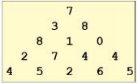

# 분할정복법과 동적프로그래밍 과제

## 1. 배열의 압축

문제 설명 
    
    0과 1로 이루어진 2^n x 2^n 크기의 2차원 정수 배열 arr이 있다.
    당신은 이 arr을 쿼드 트리와 같은 방식으로 압축하고자 한다. 구체적인 방식은 다음과 같다.

    1. 당신이 압축하고자 하는 특정 영역을 S라고 정의한다. 
    2. 만약 S 내부에 있는 모든 수가 같은 값이라면, S를 해당 수 하나로 압축한다. 
    3. 그렇지 않다면, S를 정확히 4개의 균일한 정사각형 영역(입출력 예를 참고할
    것.)으로 쪼갠 뒤, 각 정사각형 영역에 대해 같은 방식의 압축을 시도한다.

    arr이 매개변수로 주어지고, 위와 같은 방식으로 arr을 압축했을 때, 배열에 최
    종적으로 남는 0의 개수와 1의 개수를 배열에 담아서 return 하도록 solution 함
    수를 완성하라.

제한사항 

    arr의 행의 개수는 1 이상 1024 이하이며, 2의 거듭 제곱수 형태를 하고 있다. 
    즉, arr의 행의 개수는 1, 2, 4, 8, ..., 1024 중 하나이다. 

    arr의 각 행의 길이는 arr의 행의 개수와 같다. 즉, arr은 정사각형 배열이다. 
    arr의 각 행에 있는 모든 값은 0 또는 1 이다.

 
입출력 예

| 입력                                                                                                                                                            | 출력 |
|---------------------------------------------------------------------------------------------------------------------------------------------------------------|------|
| [ [1,1,0,0],[1,0,0,0],[1,0,0,0],[1,1,1,1] ]                                                                                                                   | [4,9] |
| [ [1,1,1,1,1,1,1,1],[0,1,1,1,1,1,1,1],[0,0,0,0,1,1,1,1], [0,1,0,0,1,1,1,1],[0,0,0,0,0,0,1,1],[0,0,0,0,0,0,0,1], [0,0,0,0,1,0,0,1],[0,0,0,0,1,1,1,1] ] | [10 15] |

## 2.

정수 n과 k를 입력받아, {1,2,3,...,n}의 부분 집합 중에서 크기가 k인 모든 부분 집합을
return 하는 프로그램을 작성하라. (main() 함수를 포함해야 함)

입력: 정수 n과 k를 입력? 5 2
출력: [1,2][1,3][1,4][1,5][2,3][2,4][2,5][3,4][3,5][4,5]

입력: 정수 n과 k를 입력? 6 3
출력: [1,2,3][1,2,4][1,2,5][1,2,6][1,3,4][1,3,5][1,3,6][1,4,5]
    [1,4,6][1,5,6][2,3,4][2,3,5][2,3,6][2,4,5][2,4,6][2,5,6]
    [3,4,5][3,4,6][3,5,6][4,5,6]

## 3. 정수 삼각형

문제설명

    
    위와 같은 삼각형의 꼭대기에서 바닥까지 이어지는 경로 중, 거쳐간 숫자의 합이 가장 큰 경우를 찾아보려고 한다.
    아래 칸으로 이동할 때는 대각선 방향으로 한 칸 왼쪽 또는 오른쪽으로만 이동 가능하다.
    예를 들어 3에서는 그 아래칸의 8또는 1로만 이동이 가능하다 

삼각형의 정보가 담긴 배열 triangle이 매개변수로 주어질 때, 거쳐간 숫자의 최댓값을 return 하도록 solution 함수를 완성하라.

제한사항

    삼각형의 높이는 1 이상 500 이하이다. 
    삼각형을 이루고 있는 숫자는 0 이상 9999 이하이다.

입출력 예

| 입력                                                        | 출력 |
|-----------------------------------------------------------|------|
| [ [7], [3, 8], [8, 1, 0], [2, 7, 4, 4], [4, 5, 2, 6, 5] ] | 30   |

## 4. 

정수 X에 사용할 수 있는 연산은 다음과 같이 네 가지이다.

    X가 5로 나누어 떨어지면, 5로 나눈다
    X가 3으로 나누어 떨어지면, 3으로 나눈다.
    X가 2로 나누어 떨어지면, 2로 나눈다.
    1을 뺀다.

정수 N이 주어졌을 때, 위와 같은 연산 네 개를 적절히 사용해서 1을 만들려고 한다.
연산을 사용하는 횟수의 최솟값을 출력하라.

예 1: N=26,      26->25->5->1이므로, 연산의 최솟값 = 3

예 2: N = 1271,  1271->1270->254->127->126->125->25->5->1, 연산의 최솟값 = 8

# Greedy Algorithm 과제

